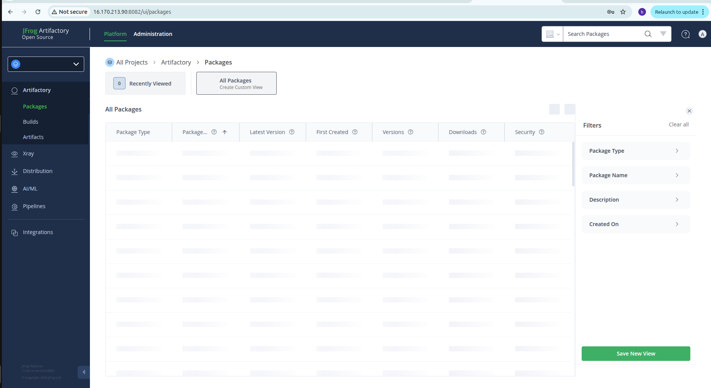
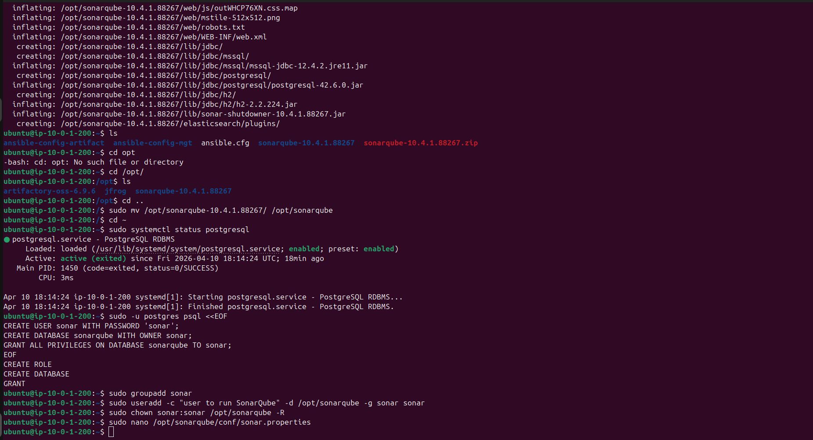
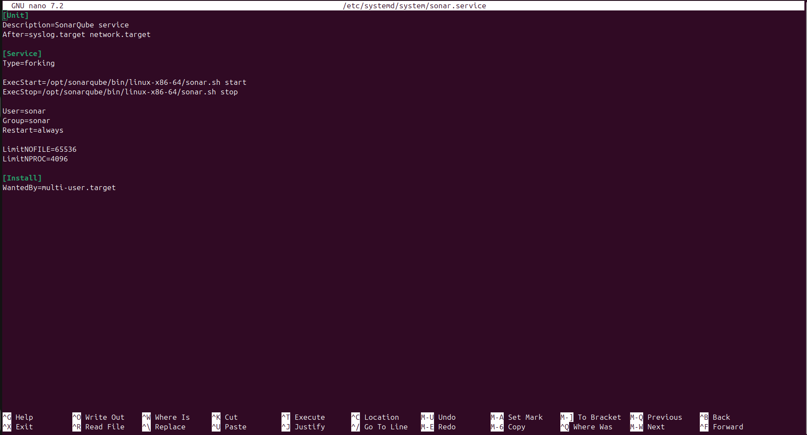

# CI/CD Pipeline for TODO Application
This project is to utilise the DevOps tools when deplpying an application exploring the Jfrog artifactory, Ansible Jenkins and Sonarqube for Quality Checks
## Prerequisite
- Git
- Jenkins
- Jfrog
- SonarQube
- Linux 
- AWS EC2


## Step 1 Preparing Jenkins
forking the Todo Appplication to Github repo from Steghub 
```sh
  https https://github.com/StegTechHub/php-todo.git
```

## Step SSHing into Jenkins Server and Installing the dependencies
```sh
  eval $(ssh-agent -s)
  ssh-add ~/.ssh/ubuntu_lb.pem

  ssh -A ubuntu@public-ip

 ```
Installing dependencies
```sh
  sudo apt install -y zip libapache2-mod-php phploc php-
  {xml, bcmath,bz2,intl,gd,mbstring,mysql,zip}
```

Installing Jenkins Plugins 
   - Plot Plugin
   - Artifactory Plugin


Installing Jfrog artifactory and starting it to verify it is running on Jenkins Server


Accessing Jfrog UI and login using default credentials 
     username: admin
     password: password



Configuring The Jfrog Artifactory Server on Jenkins
Accessing Jenkins UI and Navigating to System configuration


# Phase 2 Integration of Artifactory with Jenkins

## Step 2 Integrating Artifactory Repository with Jenkins
On Jenkins UI create a multibranch Jenkins Pipeline


Create a Jenkinsfile on the Repo


Running the Pipeline to ensure the steps are working


# Phase 3- Code Quality Analysis
## Step 1 Implementing Code Analysis using phploc
The most commonly used tool for code analysis is phploc.This step can be integrated into jenkinsfile pipeline and saving the output in csv file
```sh
   stage('Code Analysis') {
      steps {
            sh  'phploc app/ --log-csv build/logs/phploc.csv'
      }
   }
```

## Step 2-Plotting the Data using plot plugin
Plotting the data using Jenkins Plugin

## Step 3- Archiving the Application on Atrifactory
Packaging the Application into an Artifact and Deploying it to Artifactory
```sh
   stage ('Package Artifact')  {
       steps {
               sh 'zip -qr php-todo.zip ${WORKSPACE}/*'
       }
   }
```
## Step 4- Deploy application to Jfrog Artifactory
Publishing the artifact into Artifactory
```sh
   stage ('Deploy to Dev Environment') {
       steps {
       build job: 'ansible-project/main', parameters: [[$class:
    'StringParameterValue', name: 'env', value: 'dev']], propagate:
    false, wait: true
       }
   }
```

## Step 5.Implementation of Quality Gate
This can only be achieved using Sonarqube Server.
## SonarQube Installation
we will install Sonarqube on Jenkins Server runnning ubuntu 20.04 with postgresql as Backend Database

```sh
   sudo sysctl -w vm.max_map_count=262144
   sudo sysctl -w fs.file-max=65536
   ulimit -n 65536
   ulimit -u 4096

```

update the file path below
   sudo nano /etc/security/limits.conf


## Installation of Postgresql Database
After installation of postgresql and checking the statu is up to create a user


## Installation of SonarQube


## Configure Sonarqube 

After installing sonarqube a user will be created to run sonarqube


Starting SonarQube as a sonar user

Configuring Sonarqube as Systemd Service


Accessing Sonarqube Web UI
